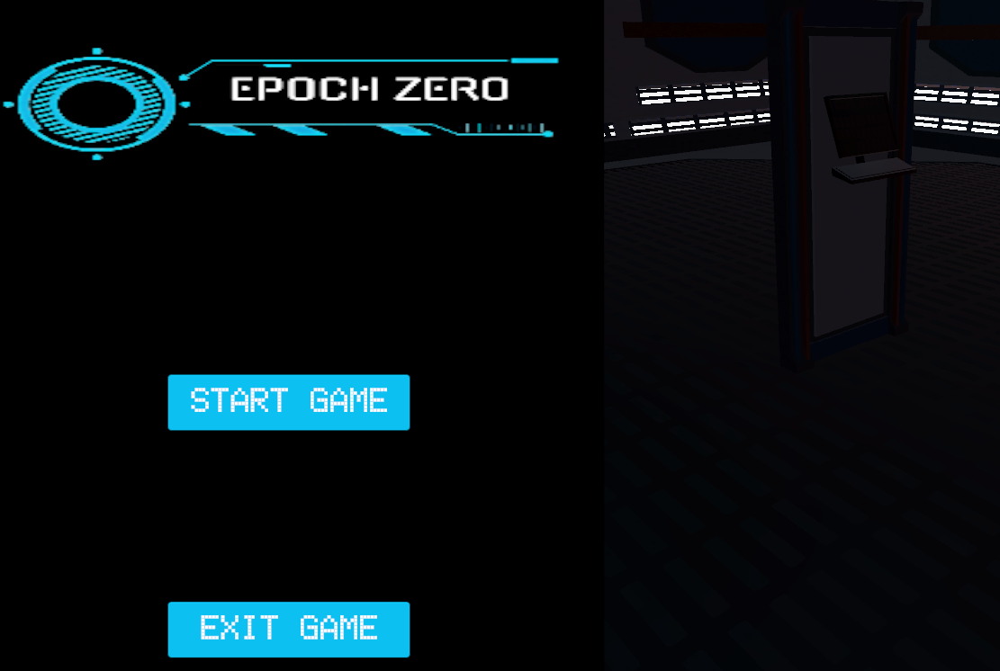
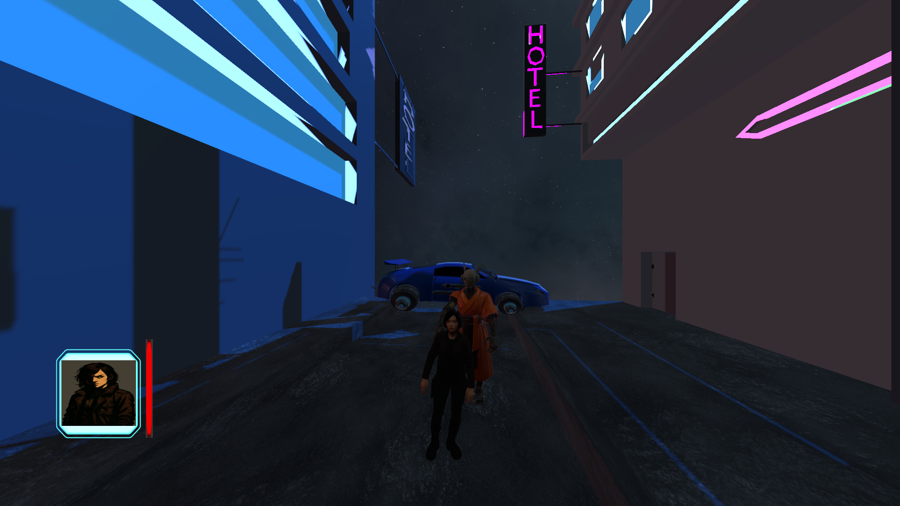
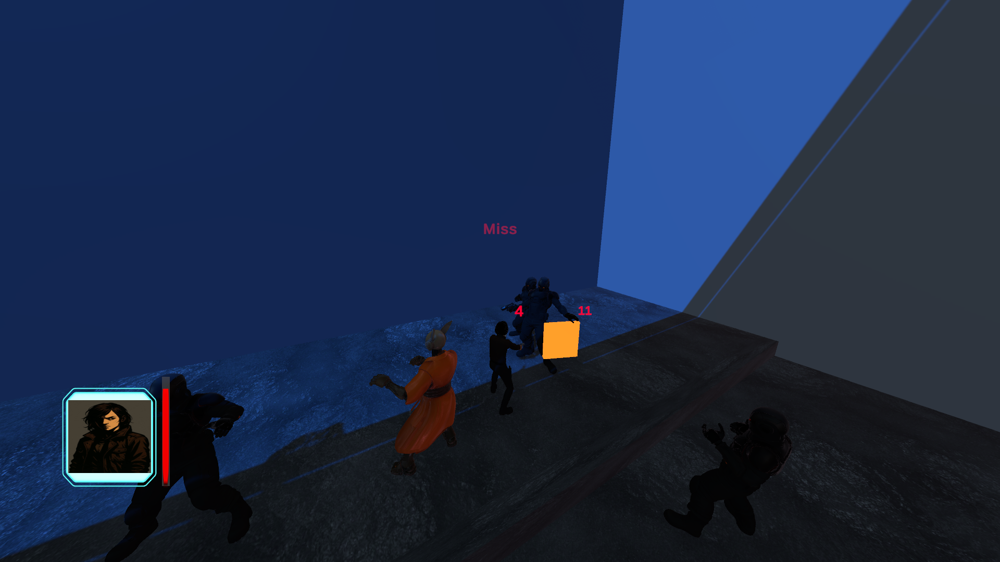
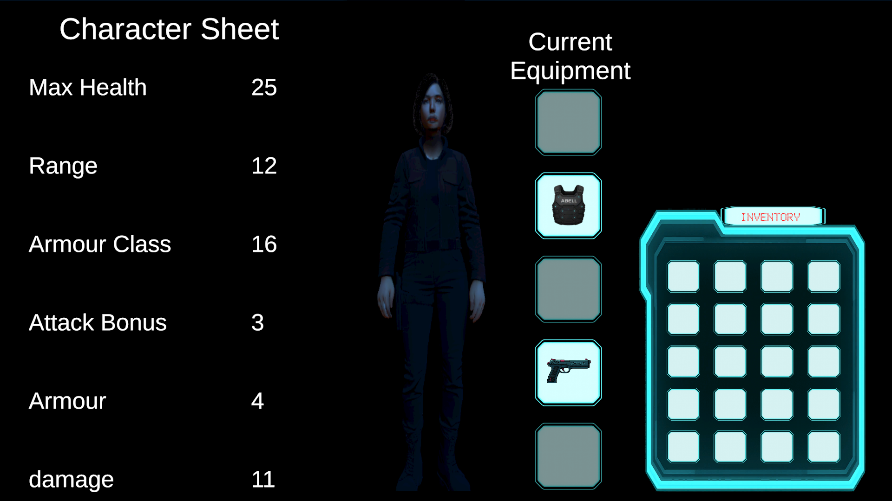
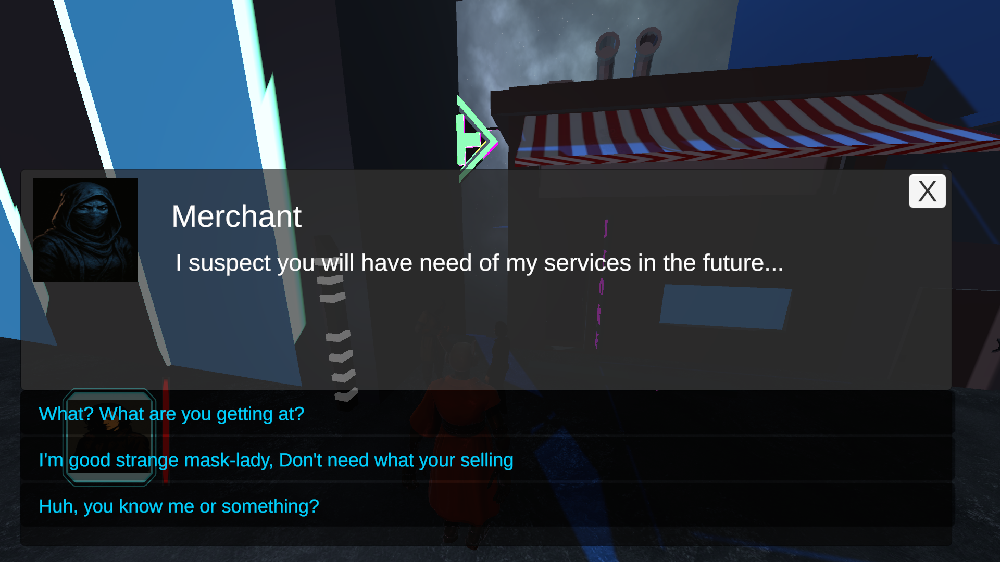
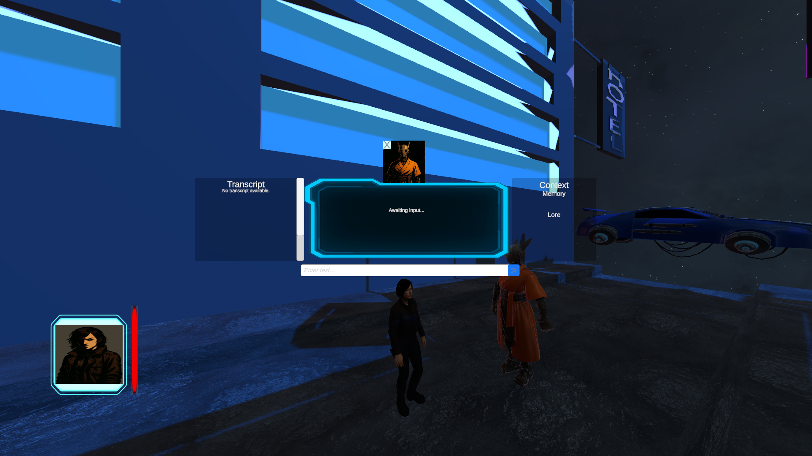

# Epoch Zero — Vertical Slice RPG

## Overview

**Epoch Zero** is a narrative-driven CRPG vertical slice built in **Unity (C#)** that demonstrates systems-based game design and the integration of AI-driven characters into a responsive game world.

The project focuses on how traditional RPG systems—combat, inventory, dialogue, and world state—can be orchestrated alongside an AI companion whose behaviour adapts based on player choices and in-world events. Rather than treating AI as a standalone chatbot, Epoch Zero embeds AI directly into gameplay, progression, and narrative context.

---

## Core Vertical Slice Loop

Epoch Zero is set on the moon of **Europa**. The player takes on the role of **Zero**, a hacker accompanied by an AI companion, **Cassandra**, and is contracted by a mysterious broker to infiltrate a secured data center.

To reach the target location, the player traverses an alleyway environment and must decide how to obtain access credentials—either by negotiating with a sketchy merchant or fighting through a hostile gang. These decisions influence subsequent world state, including how guards inside the data center react to the player.

Throughout the slice, player actions and dialogue choices are recorded and reflected in Cassandra’s memory and responses. The slice concludes once the data center encounter is resolved, forming a complete, choice-driven gameplay loop.

---

## Key Systems

### Combat System

The combat system is a simplified, D&D-inspired ruleset focused on stat-driven resolution rather than complex turn management.

- Attacks are resolved using a **d20 roll** against the opponent’s **Armor Class (AC)**.
- If the roll exceeds the target’s AC, the attack succeeds; otherwise, it misses.
- Damage is **static** and derived directly from character stats rather than additional dice rolls.
- A short cooldown (~0.6 seconds) prevents action spamming and controls combat pacing.
- Combat directly modifies the target’s health stat. When health reaches zero, the combatant is defeated and remaining actors select a new valid target.

---

### Stats System

The stats system acts as the shared data model for all gameplay systems in the vertical slice.

Core stats include:
- Maximum Health  
- Current Health  
- Damage  
- Attack Range  
- Defense (damage mitigation)  
- Armor Class (AC)

Combat systems read directly from these values to resolve hit checks, damage application, and death conditions. Equipment modifies stats through a modular modifier system, allowing multiple systems to operate over a consistent, extensible data model.

---

### Inventory & Equipment

The inventory system is divided into two layers: a general inventory and a set of equipped item slots.

- Characters have fixed equipment slots corresponding to different body sections (e.g. weapon, armor, head, gloves, legs/boots).
- Only equipped items actively modify character stats.
- Items are data-driven assets containing predefined stat modifiers.
- Equipping or unequipping items applies or removes their modifiers from the character’s stats.
- The UI supports equipping, unequipping, and swapping items directly.

The equipment interface is presented alongside a character preview and live stat display, allowing players to immediately see how equipment choices affect their character.

---

### Game Manager / Event Runner

A central **Game Manager** acts as a global orchestration layer for world state and slice progression.

Instead of hardcoding logic across individual systems, the Game Manager exposes discrete game events that can be triggered from multiple entry points, including dialogue choices, proximity triggers, and scripted encounters.

These events can:
- Progress objectives
- Enable or disable world elements (e.g. shield doors)
- Trigger combat encounters
- Start or end dialogue interactions
- Grant items to the player
- Control the demo end state

A lightweight **event runner** allows systems to invoke these events using simple identifiers, keeping progression logic centralised while allowing gameplay systems to remain loosely coupled. The Game Manager also serves as the integration point for AI context updates.

---

### Dialogue & Interaction

The vertical slice supports two dialogue interaction modes:

**Pre-authored Dialogue**
- Triggered by direct interaction or proximity-based world triggers
- Displays character dialogue alongside predefined player choices
- Selected choices can invoke game events via the event runner, driving progression and world state changes

**AI-Driven Dialogue**
- Uses the same dialogue interface, extended with a free-text player input field
- Displays a visible conversation transcript
- Player input is passed to the AI system, which responds based on injected context and memory

Both dialogue modes are integrated into the same world-state and event architecture.

---

## AI Integration (High-Level)

### Model & Inference
The AI companion uses a fine-tuned **Mistral 7B–class language model** served via an external inference endpoint. Player input is combined with injected context—including dialogue history, world state, memory entries, and lore—to form a structured request sent as a JSON payload.

AI responses are returned to the game and displayed through the same dialogue interface used for authored dialogue, maintaining UI consistency.

### Memory & Context
Key player decisions and world events are recorded via the Game Manager and stored in a memory library. Existing memories can be updated if player choices change, ensuring AI responses remain consistent with evolving game state and narrative canon.

### Detailed AI Architecture
This README intentionally keeps AI integration high-level.  
For a deeper technical breakdown of the AI pipeline—including prompt assembly, memory retrieval, context ranking, and inference orchestration—see the dedicated **AI Interface repository**:

> **AI Interface & Inference Documentation:**  
> *(link to repo here)*

### Local Inference Considerations
Local inference was explored during development; however, running the model locally in a Windows-based environment introduced practical constraints around optimisation and quantisation. As a result, the project uses an external inference endpoint for stability and performance while maintaining an architecture that can support local deployment where appropriate tooling is available.

---

## Purpose of the Vertical Slice

This vertical slice was created to explore how AI-driven characters can exist as integrated components of a game system rather than as isolated chatbot interactions.

Epoch Zero embeds AI behaviour directly into gameplay, progression, and player decision-making. Player choices influence not only immediate outcomes, but also how the AI companion interprets events, remembers past encounters, and responds in future interactions.

The project addresses the common disconnect between AI systems and the worlds they inhabit by treating AI as an active participant in a responsive game ecosystem.

---

## Known Limitations & Future Improvements

- Improved AI response grounding through additional fine-tuning
- Introduction of middleware for post-processing and canonical validation
- Enhanced context resolution for near-miss references
- Expanded slice length and deeper combat iteration

These limitations represent understood trade-offs within the scope of a vertical slice and clear opportunities for iteration.

---

## What This Project Demonstrates

- Systems-driven game design in Unity using C#
- Modular, loosely coupled gameplay architecture
- Event-based world and progression management
- Integration of AI dialogue, memory, and context into gameplay
- Clear separation between authored content and AI-driven interaction
- Delivery of a complete, focused vertical slice
